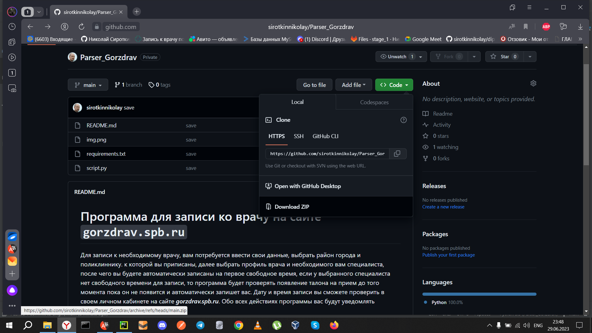

# Программа для записи ко врачу на сайте `gorzdrav.spb.ru`

Для записи к необходимому врачу, вам потребуется ввести свои данные,
выбрать район города и поликлиннику. к которой вы приписаны, далее выбрать 
профиль врача и необходимого вам специалиста, после чего вы будете автоматически 
записаны на первое свободное время, если у выбранного специалиста нет свободного
времени для записи, то программа будет проверять появление талона на прием
до того момента пока он не появится и автоматически запишет вас. Дату и время записи
вы сможете проверить в своем личном кабинете на сайте ***gorzdrav.spb.ru***. Обо всех
действиях программы вас будут уведомлять сообщения в командной строке.

1. Установите Python с официального сайта:  https://www.python.org/downloads/release/python-395/ 
версия 3.9.5
2. Загрузите и установите с официального сайта Google Chrome: https://www.google.ru/intl/ru/chrome/browser-tools/
3. Установите ***Chromedriver***, для этого необходимо знать версию вашего браузера Google Chrome:
Откройте браузер Chrome нажмем три точки >>> «Справка» >>> «О браузере Google Chrome».
Загрузите и установите ***Chromedriver*** с официального сайта:
https://sites.google.com/chromium.org/driver/downloads
2. Загрузите на свой компьютер архив с проектом и распакуйте его:

https://github.com/sirotkinnikolay/Parser_Gorzdrav.git
3. Запустите командную строку:
Нажмите "Windows" + "R", чтобы открыть программу Run. Введите "cmd" и нажмите "Enter".
4. Перейдите в папку проекта и установите зависимости: 
`python -m pip install -r requirements.txt`
5. Для запуска программы введите команду: `start Python script.py`
 